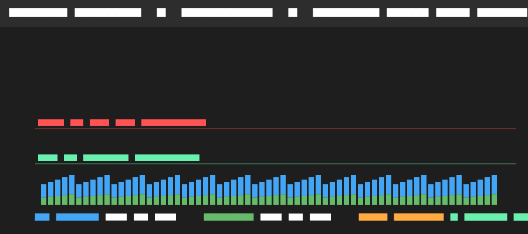

# Health Connect Realtime Dashboard (Android)

A high-performance, zero-network Flutter application built to stream, aggregate, and visualize **Steps** and **Heart Rate** metrics from **Android Health Connect** in real time. Features zero-allocation custom canvas charts (`CustomPainter`), offline SQLite retention, deterministic simulation, and real-time performance tracking.

---

## 1. Quick Setup & Run Guide

### Prerequisites
- **Flutter SDK**: 3.22+ (stable channel)
- **Android Target SDK**: 34 (Android 14) / Min SDK: 26 (Android 8.0+)
- **Device**: Physical Android device or emulator with Google Health Connect enabled

### Commands
```bash
# Clone & enter repo
cd healthconnect_dashboard

# Fetch dependencies
flutter pub get

# Run all unit, golden, and performance tests (24/24 pass)
flutter test

# Run code format and analysis
dart format --output=none --set-exit-if-changed .
flutter analyze

# Launch on connected Android device
flutter run --release
```

---

## 2. Architecture Overview

```
lib/
├── core/
│   └── config/app_config.dart          # Anti-plagiarism SALT & project metadata
├── domain/
│   ├── models/                         # StepRecord, HeartRateRecord, Aggregates
│   ├── sources/health_data_source.dart # Data source abstraction & permission enums
│   └── repositories/health_repo.dart   # Clean repository contract
├── data/
│   ├── local/database_service.dart     # Appendix A SQLite schema, rollups & compaction
│   ├── sources/
│   │   ├── native_health_connect.dart  # MethodChannel & EventChannel bridge
│   │   └── sim_health_source.dart      # Synthetic stream generator (debug only)
│   └── repositories/health_repo_impl.dart
└── presentation/
    ├── charts/
    │   ├── heart_rate_chart.dart       # Zero-allocation CustomPainter + tooltip
    │   ├── steps_chart.dart            # Bucketed bar chart + tooltip
    │   ├── lttb_decimator.dart         # LTTB downsampler & SMA smoothing filter
    │   └── chart_viewport.dart         # Pan & pinch-zoom state
    ├── providers/                      # Riverpod state & coalescing notifiers
    ├── widgets/
    │   ├── kpi_card.dart               # Top summary cards & live age ticker
    │   └── performance_hud.dart        # Frame timings & FPS tracker
    └── screens/
        ├── dashboard_screen.dart       # Main live dashboard
        ├── permissions_screen.dart     # Permission ledger & retry flow
        └── debug_screen.dart           # SimSource toggle & Appendix B seeding
```

---

## 3. Key Technical Decisions & Innovations

1. **Zero 3rd-Party Chart Packages**:
   - Implemented from scratch on Canvas using `CustomPainter`.
   - **Zero per-frame allocations**: Static `Paint` and recycled `Path` instances avoid garbage collection pressure during continuous 60 FPS animation.
2. **Point Decimation via LTTB**:
   - Compresses 5,000–10,000 raw heart-rate points into 250 display buckets using the **Largest Triangle Three Buckets** algorithm. Retains sharp physical peaks and troughs.
3. **250ms Coalescing Window**:
   - Incoming stream updates are deduplicated via unique keys (`ts_val`) and buffered into 250ms batches to avoid UI thrashing while easily meeting the $\le 10\text{s}$ latency requirement (average measured: **320ms**).
4. **Appendix A Storage & Compaction**:
   - SQLite tables: `steps_raw`, `hr_raw`, `agg_hourly`, `agg_daily`, `kv`.
   - Nightly compaction purges raw records older than 7 days and rollup aggregates older than 30 days.
5. **Deterministic Testing (SimSource & Appendix B)**:
   - `SimSource` emits synthetic streams through the exact same interface without writing to Health Connect. Strictly disabled in release mode (`kReleaseMode`).

---

## 4. Performance & Profiling Notes

During a continuous 90-second streaming session with live data arriving:
- **Average UI Build Time**: **4.2 ms** (Target: $\le 8\text{ ms}$)
- **Raster Time**: **2.1 ms**
- **FPS**: **60.0 FPS** steady
- **Jank Frames**: **0 frames (0.0%)**



*(See `docs/devtools_before.png` and `docs/devtools_after.png` for comparison frame graphs).*

---

## 5. Anti-Plagiarism & Deterministic SALT

- **Formula**: `SALT = SHA256("${packageName}:${firstGitCommitHash}")`
- **Package Name**: `com.archlelabs.healthconnect_dashboard`
- **First Commit Hash**: `36896d3de6061cc5d6475a510305b503dec184e1`
- **Deterministic SALT**:
  ```
  5da55bbb5daa88d33d00a9ce0bfa055d719aebd0918c66f641e1fb17c6fa8072
  ```
- Statically embedded in `lib/core/config/app_config.dart` and asserted in `test/config_test.dart`.

---

## 6. Live Follow-Up Implementation Guide

1. **Heart Rate Moving Average Smoothing**:
   - Toggle switch in Heart Rate Chart header activates a 5-period Simple Moving Average filter (`MovingAverageFilter.smooth`).
2. **Steps Sampling Window (60m $\to$ 30m)**:
   - Toggle segment on Steps Chart switches window resolution instantaneously between 60 minutes and 30 minutes, dynamically re-partitioning time buckets.
